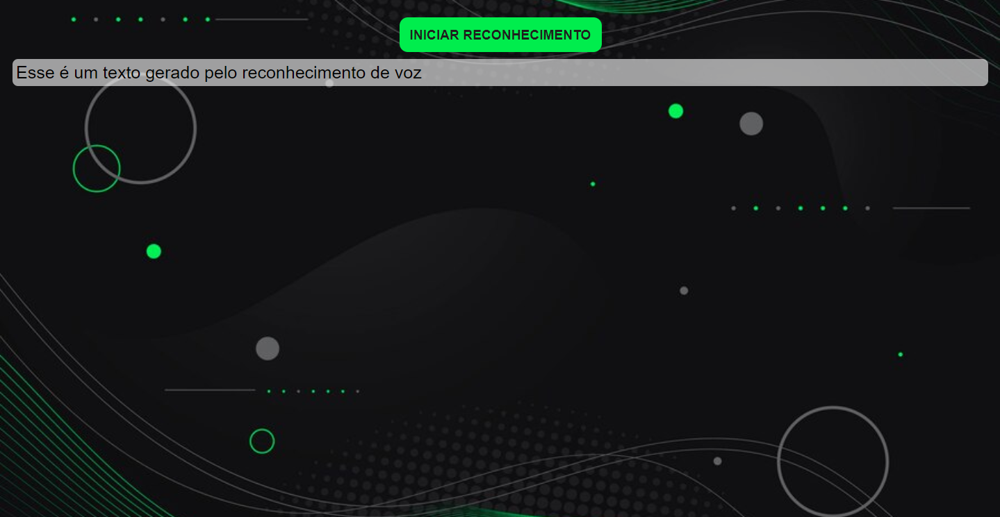

# <b>PROJETO: RECONHECIMENTO DE VOZ COM JS</b>




- HTML;
- CSS;
- JS.

<br>  


#### Web Speech API
```
https://developer.mozilla.org/en-US/docs/Web/API/Web_Speech_API/Using_the_Web_Speech_API
```

<br>


#### Código de referência
```
https://www.instagram.com/p/CnfafcugLz5/
```